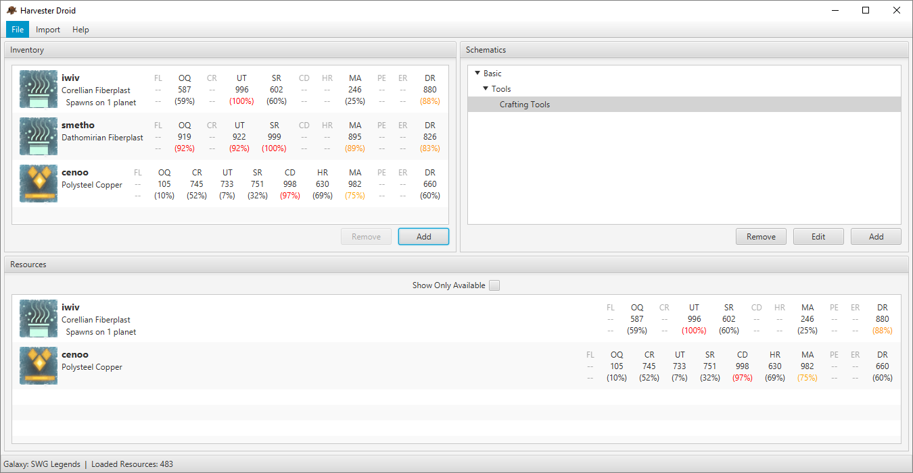

=====================================================================

HarvesterDroid is intended to be a simple resource tracking and management tool for Star Wars Galaxies. The core goal of HarvesterDroid is to obtain the latest resources and compare them across your stashed inventory resources. In the end, HarvesterDroid has been programmed from the ground up to be easily modified for tracking from multiple resource websites that provide XML exports.

I started on this project almost a year ago and it is fairly complete for the most part to work with GalaxyHarvester. There isn't much more refactoring that needs to be done in order for it to work with other sites such as SWGCraft

Programmed with love by Waverunner <3

#### Features

* Track resources based on their best weight from a defined schematic
* Easily organize your schematics within groups
* Display the best resources for a schematic
* Keep track of your top resources through the inventory
* Import a list of resources into HarvesterDroid by name
* Import Schematics that your friend shared with you

### Future

* Finalize support for use with other tracking websites
* Add basic tracking from SWGCraft
* Refactor out specific classes to api sub-module for easy implementation of other websites
* Use JSON for many of the settings instead of XML for faster processing
* Use of resource data from multiple tracking websites for a single galaxy with precedence
    * Export of a resource stats in an acceptable format for that site for import

# Getting Started
Setting up HarvesterDroid is simple! By default, HarvesterDroid will load SWGLegends as the default galaxy. You can easily change this in the preferences, along with the save settings and the theme.


The status bar displays the active galaxy and how many resources HarvesterDroid is aware of. Since this is the first time you have used HarvesterDroid, only the current resources that are provided by the tracker are known.
Each time you load up HarvesterDroid, it will attempt to retrieve the latest resources as provided by the tracker. Any new resources that are found will start being tracked by HarvesterDroid. If a resource that is known by HarvesterDroid has despawned, it'll still be tracked it just won't be available unless it's in your inventory.

Anything saved by HarvesterDroid will be saved to your user directory under the ".harvesterdroid" folder. Anytime HarvesterDroid's root directory is mentioned throughout this section, it is this folder.

NOTE: Currently GalaxyHarvester is the only supported Tracker.

## Schematics
HarvesterDroid won't display any resources unless there is an active schematic, so lets create one! Under the Schematics pane, click on the Add button to bring up the Create Schematic dialog.


**_Name_**: A name for the schematic. It can be anything!
**_Group_**: The group this schematic will belong to. Anything separated by a colon (:) will be within that group. As an example, a group of "A:B:C" will have its schematic nested as A->B->C->Schematic
**_Resources_**: The resources this schematic contains. These are either resource groups (Metals) or specific resource types (Desh Copper). These are all defined depending on the active tracker.
**_Attributes_**: Attributes pertain to the attributes on the added resource types. Values range from 1-100 for each added attribute. HarvesterDroid will ensure the sum of these attributes are always 100.


Schematics are saved under HarvesterDroid's root directory within the schematics.xml file. You can share this file with others so they can import it to HarvesterDroid. This can be done by selecting Import->Schematics from the Main Menu.

## Resources
HarvesterDroid will display a list of resources when there is a Schematic selected within the Schematics pane. These resources are the best resources known by HarvesterDroid for the particular schematic.


Attributes for the resource that are within cap range are distinguished by either yellow, orange, or red. Note that this will be shown regardless if the schematic calls for that attribute or not. In the case of this Schematic, only Conductivity is followed however, Decay Resistance and Unit Toughness are red (stat is almost/at cap).

With the Resources list active, hovering over "Spawns on ... planet(s)" will inform you on what planets the resource can be found on. If the resource has despawned, this text will not be shown.


You can filter the list by either showing only resources that are available to you, or the best resources that HarvesterDroid can calculate from its loaded resources. This can be done through the "Show Only Available" check box.

Double clicking on any resource in this view will automatically add it to your inventory if it's not already there.

### Importing Resources

Since trackers only provide us with the current resources, HarvesterDroid can be provided a list of resource names to then fetch from the tracker. You can do this by selecting Import->Resources... from the Main Menu. A dialog is presented that will allow you to enter in a list of names separated by either commas, semi-colons, or spaces. You can confirm your resources are loaded by checking the Loaded Resources status in the status bar.

Resource files are located under HarvesterDroid's root directory followed by the name of the tracker. HarvesterDroid stores a current_resources.dl file obtained from the tracker, a list of servers from the tracker, and also it's stored resources (resources_server.odb).

## Inventory
The inventory allows you to highlight specific resources to HarvesterDroid. They will always be considered available even when they despawn.


As you'll notice, the display of the resource is the same as within the Resources pane. This is true for anytime a resource is previewed.

You can easily add resources to your inventory by selecting the Add button.


Only the name of the resource must be entered. HarvesterDroid will obtain the rest of the information from the tracker once the stats are retrieved. This must be done before adding the resource to your inventory.



Here we added two new resources to HarvesterDroid: smetho and cenoo. The Resources pane automatically updated to display cenoo as the new best resource for the schematic. Remember, HarvesterDroid only knows about currently spawned resources or despawned resources that were originally tracked by HarvesterDroid. Adding the resources to our Inventory made HarvesterDroid aware of these despawned resources since they were never imported.

The inventory is saved to the root HarvesterDroid directory within inventory.xml.

## Preferences

The Preferences dialog allows you to do a couple house-keeping tasks. You can disable auto-saving, the save-nag, change the galaxy, and change the theme.

_Auto Save_: Performed every time HarvesterDroid is closed.
_Save Nag_: When exiting HarvesterDroid, you will be asked if you wish to save. Saying no will not save your changes to the inventory or schematics. This ignores Auto Save.
_Theme_: The style of the interface. Any custom Theme's can be selected here. Switching themes requires HarvesterDroid to restart.

### Themes
By default, the Java theme is used. Built-in themes are Flat Droid and Imperial. You can create your own themes too. All you need to do is define the location of the CSS file within the themes.xml file located in your root HarvesterDroid directory.

Example themes.xml is provided below. Note that this follows the same format as the [themes.xml](src/main/resources/themes.xml) in the source. Paths are relative to the root HarvesterDroid directory.
````
<?xml version="1.0" encoding="UTF-8" standalone="yes"?>
<themes>
    <theme name="My Custom Theme" path="css/my_custom_theme.css"/>
</themes>
````

My Custom Theme's CSS would then be located within the system's user directory at .harvesterdroid/css/my_custom_theme.css

Standard JavaFX CSS styling is used throughout HarvesterDroid. You can look at [imperial.css](src/main/resources/css/imperial.css) and [flat_droid.css](src/main/resources/css/flat_droid.css) as examples on how the themes were created.

# Misc

Credits to the following, wouldn't be possible for HarvesterDroid to exist

* Resource data provided by GalaxyHarvester
* SWG Emulator communities
* ModTheGalaxy
* SoE, without you we wouldn't have Star Wars Galaxies!
* LucasArts for the beauty that is Star Wars
* controls(fx), flexmark, mvvmfx

### Contributing

HarvesterDroid is licensed under the GNU GPLv3 license. Meaning you can freely use this program according to the terms of the license. I also ask that you provide credit and make your work open source if it's based on this code.

Gradle is this projects dependency and build manager. In order to build the project, simply run './gradlew' in your command line. Built using Java 8u141.
Checkstyle is used to check quality of code, based off of Google Java Style with a minor exception to line length (150 instead of 100).

I will shamelessly plug in a PayPal.me link [here](http://paypal.me/HiImLewis/5), do with it what you will
